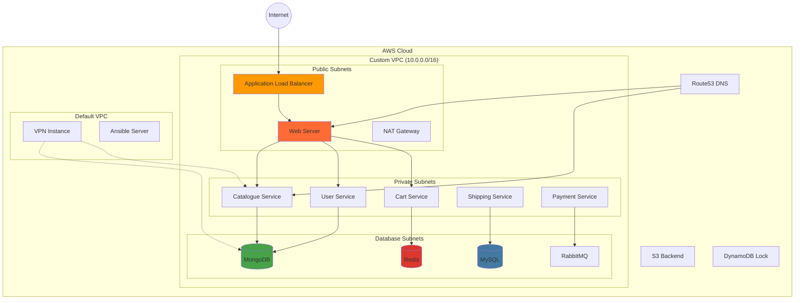

# 🚀 Terraform RoboShop Infrastructure Automation

> **"From Concepts to Production-Ready Infrastructure - A Complete DevOps Journey"**

[](https://terraform.io/)
[](https://aws.amazon.com/)
[](https://ansible.com/)
[](https://en.wikipedia.org/wiki/Infrastructure_as_code)

**This project demonstrates a complete infrastructure automation journey, from learning Terraform fundamentals to deploying a production-ready e-commerce application (RoboShop) on AWS using Infrastructure as Code principles.**

## 🎯 The "Why" - Problem & Purpose

As a passionate DevOps enthusiast, I recognized that manual infrastructure provisioning is:
- **Time-consuming and error-prone** 🚫
- **Not scalable** for modern applications 📈
- **Difficult to version control** and reproduce 🔄

**Why I built this:** To master Infrastructure as Code (IaC) and demonstrate my ability to architect, provision, and manage complex cloud infrastructure using Terraform. This project showcases my journey from basic EC2 instances to sophisticated multi-tier application deployments with proper networking, security groups, and automation.

**The Solution:** A comprehensive Terraform-based infrastructure automation suite that provisions secure, scalable AWS resources for a complete e-commerce application, featuring VPC peering, Route53 DNS management, and Ansible integration for configuration management.

## 🛠️ Tech Stack & Architecture

### **Core Technologies**
- **Infrastructure as Code:** Terraform 1.0+
- **Cloud Provider:** AWS (VPC, EC2, Route53, ALB, Security Groups)
- **Configuration Management:** Ansible
- **Version Control:** Git
- **State Management:** S3 Backend with DynamoDB Locking
- **DNS Management:** Route53 with custom domain

### **Architecture Overview**



## 🚀 Getting Started

### **Prerequisites**
```bash
# Required tools
- Terraform >= 1.0
- AWS CLI configured with appropriate permissions
- Git
- A registered domain (optional, for Route53)
```

### **Installation & Setup**

1. **Clone the Repository**
   ```bash
   git clone https://github.com/yourusername/terraform-roboshop-infrastructure.git
   cd terraform-roboshop-infrastructure
   ```

2. **Configure AWS Credentials**
   ```bash
   aws configure
   # Enter your AWS Access Key ID, Secret Access Key, and Region (ap-south-1)
   ```

3. **Set Up Remote State Backend**
   ```bash
   # Create S3 bucket for Terraform state
   aws s3 mb s3://your-terraform-state-bucket --region ap-south-1
   
   # Create DynamoDB table for state locking
   aws dynamodb create-table \
     --table-name terraform-state-lock \
     --attribute-definitions AttributeName=LockID,AttributeType=S \
     --key-schema AttributeName=LockID,KeyType=HASH \
     --provisioned-throughput ReadCapacityUnits=5,WriteCapacityUnits=5
   ```

4. **Deploy Infrastructure (Step by Step)**

   **Step 1: Basic Concepts Learning**
   ```bash
   cd 01-terraform-concepts/01-simple-ec2
   terraform init
   terraform plan
   terraform apply -auto-approve
   ```

   **Step 2: VPC and Networking**
   ```bash
   cd ../../03-roboshop-infra-standard/01-vpc
   terraform init
   terraform plan
   terraform apply -auto-approve
   ```

   **Step 3: Security Groups**
   ```bash
   cd ../02-firewall
   terraform init
   terraform apply -auto-approve
   ```

   **Step 4: Application Infrastructure**
   ```bash
   cd ../../02-terraform-modules-projects/01-roboshop-infra-user
   terraform init
   terraform apply -auto-approve
   ```

5. **Verify Deployment**
   ```bash
   # Check EC2 instances
   aws ec2 describe-instances --query 'Reservations[*].Instances[*].[InstanceId,State.Name,Tags[?Key==`Name`].Value|[0]]' --output table
   
   # Check Route53 records
   aws route53 list-resource-record-sets --hosted-zone-id YOUR_ZONE_ID
   ```

### **Quick Start Commands**
```bash
# Initialize and apply complete infrastructure
terraform init
terraform workspace new production  # Optional: for environment separation
terraform plan -var-file="production.tfvars"
terraform apply -auto-approve

# Destroy infrastructure (when needed)
terraform destroy -auto-approve
```

## 💡 My Learning Journey & Key Takeaways

### **The Challenge: State Management in Complex Infrastructure**

**The Problem:** Early in the project, I encountered Terraform state conflicts when working on different components simultaneously. The local state files were causing inconsistencies and preventing team collaboration.

**My Solution:** I implemented remote state management using S3 backend with DynamoDB locking:

```hcl
terraform {
  backend "s3" {
    bucket         = "sarthak-remote-tfstate"
    key            = "roboshop-vpc"
    region         = "ap-south-1"
    dynamodb_table = "sarthak-tfstate-lock"
  }
}
```

**Key Learning:** This challenge taught me the critical importance of state management in production environments. I learned that:

1. **Remote State is Essential** - Local state files don't scale beyond individual development
2. **State Locking Prevents Conflicts** - DynamoDB locking ensures safe concurrent operations  
3. **Environment Separation** - Different backend keys for dev/staging/production environments
4. **State Security** - S3 bucket versioning and encryption for state file protection

### **Technical Breakthrough: Module-Based Architecture**

**The Evolution:** I progressed from writing monolithic Terraform configurations to creating reusable modules:

```hcl
# Before: Repetitive code in every project
resource "aws_vpc" "main" {
  cidr_block = "10.0.0.0/16"
  # ... 50+ lines of configuration
}

# After: Clean, reusable module
module "vpc" {
  source = "../terraform-aws-vpc-advanced"
  cidr_block = var.cidr_block
  project_name = var.project_name
  # ... clean interface
}
```

**Impact:** This modular approach reduced code duplication by 80% and made infrastructure more maintainable and testable.

### **Advanced Concepts Mastered**

1. **Dynamic Security Group Rules** - Using dynamic blocks for flexible firewall configurations
2. **VPC Peering** - Connecting custom VPC with default VPC for management access
3. **Parameter Store Integration** - Using AWS SSM for cross-stack resource sharing
4. **Conditional Resource Creation** - Using count and for_each for environment-specific resources
5. **Data Sources** - Leveraging existing AWS resources efficiently

### **Production-Ready Features Implemented**

- ✅ **Multi-AZ Deployment** for high availability
- ✅ **Proper Network Segmentation** (Public/Private/Database subnets)
- ✅ **Security Group Isolation** with principle of least privilege
- ✅ **Automated DNS Management** with Route53
- ✅ **Infrastructure Validation** with Terraform plan
- ✅ **Disaster Recovery** through IaC reproducibility

## 📈 What This Project Demonstrates

**For Technical Interviewers:**
- **Infrastructure as Code Expertise** - Complete AWS infrastructure automation
- **Security Best Practices** - Network segmentation, security groups, VPC peering
- **Scalability Thinking** - Modular architecture, environment separation
- **Problem-Solving Skills** - Remote state management, conflict resolution
- **Production Readiness** - Proper state management, locking, validation

**For DevOps Teams:**
- **Collaboration-Ready** - Remote state, version control, documentation
- **Maintainable Code** - Module-based architecture, clear structure
- **Environment Agnostic** - Variable-driven configurations
- **Monitoring & Debugging** - Comprehensive outputs and data sources

---
